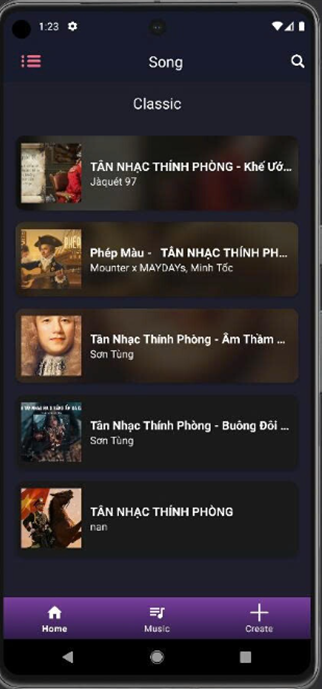
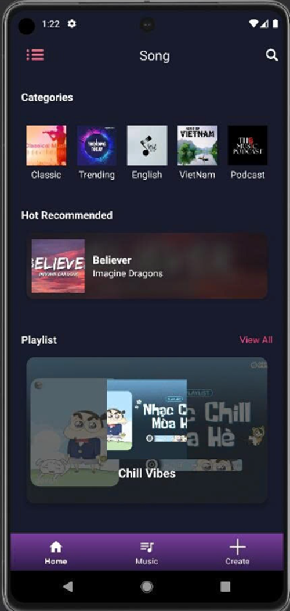
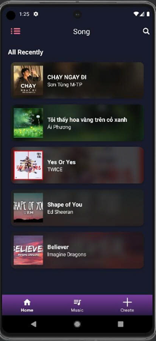
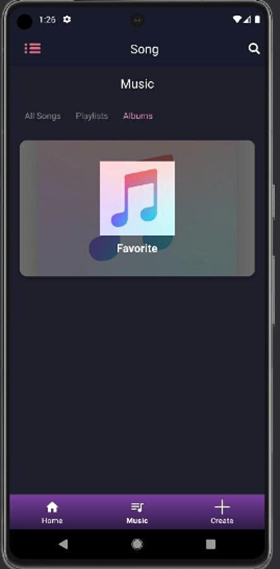

Muzic - Ứng dụng nghe nhạc trên nền tảng Android

Muzic là một ứng dụng nghe nhạc trực tuyến được phát triển nhằm mang lại trải nghiệm giải trí nhẹ nhàng, nhanh chóng với giao diện hiện đại trên hệ điều hành Android. Dự án tập trung vào việc tối ưu hóa các tính năng cơ bản, loại bỏ quảng cáo gây phiền nhiễu và cung cấp khả năng quản lý danh sách phát linh hoạt.

Các tính năng chính

Ứng dụng hỗ trợ đầy đủ các tính năng cần thiết của một trình phát nhạc hiện đại:

* Quản lý tài khoản: Đăng ký, đăng nhập và khôi phục mật khẩu thông qua Email.

* Phát nhạc trực tuyến: Hỗ trợ các nút điều khiển Play, Pause, Next, Previous và chế độ phát ngẫu nhiên (Random).

* Khám phá âm nhạc:

  * Hiển thị danh sách nhạc theo thể loại (Classic, Trending, English, VietNam, Podcast).
  

  * Đề xuất bài hát nổi bật (Hot Recommended).

  * Xem lịch sử nghe nhạc (Recently Played).
  

  * Quản lý Playlist \& Album: Người dùng có thể xem danh sách phát và tạo album cá nhân.
  

Công nghệ sử dụng:

* Ngôn ngữ lập trình: Java.
* Môi trường phát triển: Android Studio.
* Backend \& Database: \* Firebase Realtime Database: Lưu trữ thông tin người dùng, danh sách bài hát và playlist.
* Firebase Storage: Quản lý tệp tin.Google Drive: Lưu trữ tệp tin âm thanh (.mp3).
* UI Components: RecyclerView (danh sách cuộn), BottomNavigationView (thanh điều hướng), CardView.

